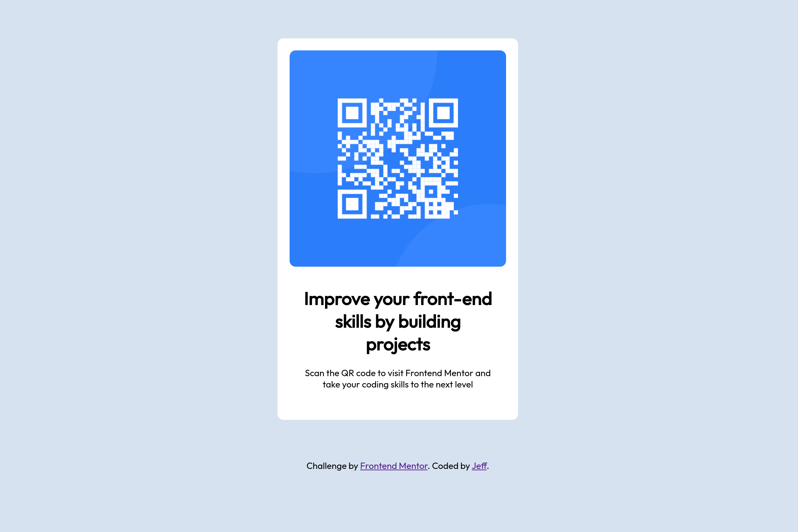

# Frontend Mentor - QR code component solution

This is a solution to the [QR code component challenge on Frontend Mentor](https://www.frontendmentor.io/challenges/qr-code-component-iux_sIO_H). Frontend Mentor challenges help you improve your coding skills by building realistic projects. 

## Table of contents

- [Overview](#overview)
  - [Screenshot](#screenshot)
  - [Links](#links)
- [My process](#my-process)
  - [Built with](#built-with)
  - [What I learned](#what-i-learned)
  - [Continued development](#continued-development)
  - [Useful resources](#useful-resources)
- [Author](#author)
- [Acknowledgments](#acknowledgments)

## Overview
This is my first challenge from front end mentor. Fun little challenge to get me started. I used a media query to select either the small (375px) css file or the large (1440px) css file. There's really nothing in between. The QR and all content gets smooshed until you reach 375px, then it snaps back to what the design looks like.

### Screenshot

### Links

- Solution URL: [GitHub Repo](https://github.com/shafferj8/qr-code-component-main)

## My process

### Built with

- Semantic HTML5 markup
- CSS custom properties
- media query
- VS code

### What I learned

I strengthened my confidence with positioning items and getting more familiar with the html flow.

### Continued development

I want to keep building my confidence with css and html.

### Useful resources

- [Stack overflow](www.stackoverflow.com) - Helped me with the media query context for selecting the correct css file based on with of screen.

## Author

- Frontend Mentor - [@shafferj8](https://www.frontendmentor.io/profile/shafferj8)
- Twitter - [@Jef_sh4f](https://www.twitter.com/Jef_sh4f)

## Acknowledgments

Did it all by myself.
